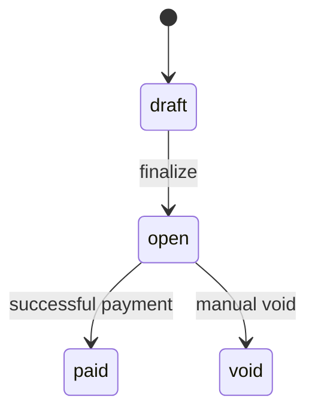

# DESIGN.md

# 1. Data Model

The system is designed around a multi-tenant billing model where a business owns customers, invoices, and webhook configurations.

## Entity Relationship

```text
Business
 ├── Customers
 ├── Invoices
 │     └── Invoice Details
 │     └── Payments
 └── Webhooks
       └── Webhook Deliveries
```

## Primary Key Strategy

All tables use UUID primary keys. UUIDs are used to avoid predictable identifiers and allow safe distributed generation without sequence coordination, which also increase secturity as UUIDs are random and cannot be guessed.

## Tables

### businesses

Stores merchant accounts authenticated via API keys.

Important fields:

* api_key_hash
* api_key_prefix

Only hashed API keys are stored to reduce blast radius if the database is compromised.

Here, I've used an api_key_hash for the Authentication token in APIs.

---

### customers

Represents customers belonging to a business.

Indexes:

* business_id

Customers are scoped to a business to maintain tenant isolation.

---

### invoices

Represents payable invoices.

Important fields:

* business_id
* customer_id
* total_amount_cents
* state
* due_date

Indexes:

* business_id
* state

Invoices contains business_id and customer_id which simplifies the query, reduce the join complexity which will be helpflu at 100x scale.

All money values are stored as integer cents to avoid floating-point precision issues.

---

### invoice_details

Stores invoice line items.

Important fields:

* invoice_id
* description
* quantity
* unit_amount_cents

The invoice total is always computed server-side from invoice details. Client-provided totals are never trusted.

---

### payments

Represents payment attempts for invoices.

Important fields:

* invoice_id
* idempotency_key
* request_hash
* status
* psp_reference
* failure_code

Unique constraint:

* (invoice_id, idempotency_key)

Idempotency-Key will be stored in the payments table, which ensure that the same request will not be processed more than once and prevent the duplicate payments. 

---

### webhooks / webhook_deliveries

Stores webhook configurations and delivery attempts.

Webhook deliveries are tracked separately so retries can happen asynchronously without blocking payment APIs.

---

## Scaling Considerations

At significantly larger scale:

* webhook delivery would move to a Queueing system such as BullMQ, RabbitMQ
* payment reconciliation workers would be added
* payment tables may require partitioning
* read replicas could be introduced to list and view APIs, but for the write Ops we will continue using the write for the data consistency, which can be introduced due to lag in syncing replicas

These were intentionally excluded to keep the implementation small and focused.

---

# 2. Invoice State Machine

## State Diagram



## State Definitions

### draft

Invoice exists but is not yet payable. (Here we're not storing the draft state, we're just assuming it's draft when users is creating it)

### open

Invoice is finalized and payment can be made for this.

### paid

Represent the paid invoices

### void

Represent the cancelled invoices.

---

## Valid Transitions

| From  | To   |
| ----- | ---- |
| draft | open |
| open  | paid |
| open  | void |

Terminal states:

* paid
* void

This small State machine is heping us to prevent the complex scenarios for now and also make it more predictable.

---

# 3. Payment Correctness & Failure Modes

## Concurrency Mechanism

The implementation uses PostgreSQL row-level locking:

```sql
SELECT * FROM invoices
WHERE id = $1
FOR UPDATE;
```

I chose row-level locking over optimistic concurrency to avoid multiple payments for the same invoice in case of the concurrent requests. Here we're using a single DB so row level locking is a good choice. In a distributed system, we could use Redis for achieving the same.

---

## Payment Flow

High-level flow:

1. Begin transaction
2. Lock invoice row
3. Validate invoice state
4. Check idempotency key
5. Insert pending payment
6. Call PSP
7. Update payment + invoice state
8. Commit transaction

---

## (a) Two concurrent payment requests

When 2 client request comes for the payment of same invoice, Only one request acquires the invoice lock first. The second request waits until the first commits.

After the first request completes:

* the invoice may already be paid
* or the payment row already exists

This guarantees that duplicate successful payments cannot occur.

---

## (b) PSP timeout (`tok_timeout`)

The PSP client timeout is intentionally shorter than the PSP delay.

Behavior:

* payment status remains `pending`
* invoice remains `open`
* API returns:

```json
{
  "status": "pending"
}
```

The client can safely retry using the same idempotency key.

This prevents the API from hanging while waiting on an unreliable external dependency.

---

## (c) PSP succeeds but service crashes before persistence

In a real payment system, PSP-side idempotency keys and reconciliation workers would also be required.

For this assignment:

* persisted payment attempts
* transactional invoice locking
* internal idempotency keys

are used to prevent duplicate logical payments.

In-Real World scenarios, we would call Payment Initiate API of the PSP and then store the Response of the API. Then we need to update the payment_status separately for the respective Payment Transactions using below 2 methods:
1. Webhook: PSP will notify us about the payment status using the webhooks, which is the simplest way to update payment status without burdening our system for polling.
2. Polling: We can write a service to poll the PSP for the payment status, which is more efficient than webhooks but requires more development effort and it could be costly if we have too many payments as we need to call PSP APIs continuously on the regular intervals.

---

## (d) Same idempotency key with different request body

Each request body is hashed and stored.

If:

* same idempotency key
* different request hash

This prevents unsafe reuse of idempotency keys across different logical operations.

---

## (e) Paying an already-paid invoice

If POST `/pay` is called on an invoice already in `paid` state:

* the request is rejected with HTTP 409 Conflict

Terminal invoice states cannot transition back into payable states.

---

# 4. Webhook Design

Webhook delivery is asynchronous and decoupled from the payment API response path.

This prevents slow or failing webhook consumers from affecting payment correctness or API latency.

Implemented events:

* invoice.created
* invoice.paid
* invoice.payment_failed

Webhook payloads are signed using HMAC SHA256.

Header:

```text
X-Dodo-Signature
X-Dodo-Delivery-Id
```

The raw payload body is signed using the webhook secret.

Retry intervals:

* 1 second
* 5 seconds
* 30 seconds

After exhausting retries:

* delivery is marked failed

In production, durable queues and replay APIs would likely be added.

---

# 5. API Key Model

Businesses authenticate using Bearer API keys.

```http
Authorization: Bearer <api_key>
```

Only hashed API keys are stored. The plaintext key is never persisted after generation.

API keys include prefixes for easier debugging and identification.

Example:

```text
dodo_sk_test_xxx
```

The current implementation uses a seeded demo business and API key to reduce unnecessary API surface area.

---

# 6. What I Cut And Why

## Webhook Retry Logic

I implemented a basic retry mechanism with exponential backoff for webhook deliveries. However, for a production system, I would use a more robust queueing solution (like BullMQ with Redis) to handle message persistence, retry scheduling, and monitoring more reliably.

## Refunds

Explicitly excluded by assignment scope.

## Partial Payments

Omitted to keep invoice state transitions simple.

## Distributed Queue Infrastructure

Webhook retries currently use lightweight async processing instead of durable queues to keep the system focused.

## Business Management APIs

A seeded demo business was used instead of building full business CRUD APIs.

## Background Reconciliation Workers

The mock PSP is synchronous, so reconciliation workers were intentionally excluded.

---

# 7. Production Readiness Gaps

If this system were productionized, the next priorities would be:

## Observability

Metrics, tracing, dashboards, and alerting.

## Durable Async Infrastructure

Webhook retries should move to durable queue systems.

## Payment Reconciliation

Background reconciliation jobs would verify external PSP state against internal payment records.

## Audit Logging

Critical state transitions should generate immutable audit logs.

## Rate Limiting

Production-grade API rate limiting would protect against abuse and accidental retry storms.
